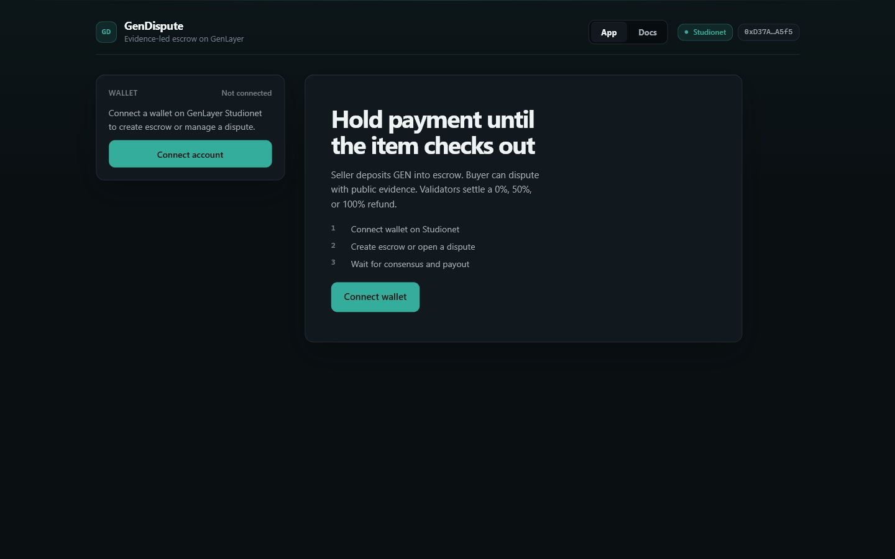

# GenDispute

GenDispute is a seller-funded GEN escrow prototype for item-not-as-described trades on GenLayer Studionet. It combines issuer-authenticated, order-specific evidence receipts with validator consensus and deterministic 0%, 50%, or 100% buyer refunds.



## Verified links

| Item | Link | Current status |
| --- | --- | --- |
| Web application | [gen-dispute.vercel.app](https://gen-dispute.vercel.app) | Production remediation frontend at `/` with reviewer documentation at `/docs` |
| Replacement contract | [`0xd5DBaE8c1A1B2A8F34dba3e4AdC62f9263EaB53d`](https://explorer-studio.genlayer.com/address/0xd5DBaE8c1A1B2A8F34dba3e4AdC62f9263EaB53d) | Remediation source deployed on Studionet; live workflow verification is in progress |
| Source repository | [dietthe030-ux/gen-dispute](https://github.com/dietthe030-ux/gen-dispute) | Public source for the current release |
| Verification record | [docs/VERIFICATION.md](docs/VERIFICATION.md) | Local remediation evidence and deployment gate status |
| Network | GenLayer Studionet, chain ID `61999` | RPC `https://studio.genlayer.com/api` |

The replacement deployment transaction [`0x13c21f...e4a73e`](https://explorer-studio.genlayer.com/tx/0x13c21f3c5d5aea282fda77c0c8d503cee8c1aff2093e6ca0b5efc11224e4a73e) is `FINALIZED` with successful GenVM execution and majority agreement. Its deployed source SHA-256 matches `contracts/gen_dispute.py`, and the public Vercel app targets this replacement contract. Remaining live-proof gaps are disclosed below.

## Trust problem

A deterministic escrow can hold funds and enforce access control, but it cannot decide whether external evidence shows that a delivered item matches its listing. Giving that decision to one marketplace administrator or hosted LLM API creates a new trusted party that can change the prompt, model, evidence, or verdict without validator agreement.

GenDispute keeps custody, state transitions, evidence authority, commitments, and payout arithmetic in the Intelligent Contract. The seller chooses a registered listing and deadline. A separate evidence issuer signs an on-chain registration that binds one receipt URL, its exact SHA-256, an observation time, and a one-time nonce to one order. The contract prevents that issuer from being the buyer or seller. The buyer can submit only a reason; neither trading party can choose evidence or supply the verdict or refund tier.

## Why GenLayer is essential

The core decision combines live HTTPS retrieval with semantic comparison against the stored listing snapshot. The deployment wallet becomes the evidence issuer as well as the Root Slot upgrader. Its signed `register_evidence_receipt` transaction binds the publisher key, exact order, canonical item policy, receipt SHA-256, observation time, and globally unique nonce. During a dispute, the contract leader fetches that receipt through `gl.nondet.web.get`, verifies the order ID, item ID, publisher ID, nonce, HTTP metadata, observation window, and byte identity, extracts a bounded JSON attestation, and evaluates only canonical facts through `gl.nondet.exec_prompt`. Raw HTML and the buyer reason do not enter the adjudication prompt. Validators independently repeat the fetch and evaluation.

A verdict is accepted only when provenance, body-hash, schema, and internal-consistency guards pass and validators agree on stable consequential fields: `reason_code`, `refund_tier`, `evidence_sufficient`, evidence hashes, and attestation hashes. Free-form summaries are not compared byte-for-byte. This source-grounded consensus and its direct on-chain payout cannot be replaced by traditional Solidity or one centralized AI response without reintroducing a trusted operator.

## How it works

### Seller

1. Connect a wallet on Studionet.
2. Name the buyer, select a registered fixture listing, choose a timeout, and deposit native GEN through `create_order`.
3. The frontend decodes the exact returned order ID from the GenVM trace. The global count is display-only and is never used to infer the created order.
4. Wait for buyer confirmation, a dispute verdict, or deadline recovery.

### Buyer

1. Load the known order ID and inspect its seller, listing snapshot, escrow, and deadline.
2. Wait until the order shows an issuer-registered receipt.
3. Confirm a correct delivery to release the full escrow to the seller, or submit only a reason through `open_dispute`.
4. If evaluation is undetermined, wait for the issuer to register a new receipt before using the single retry.

### Evidence issuer

1. Publish a receipt whose bounded attestation contains the exact `order_id`, canonical `item_id`, publisher ID, and a delivery-specific one-time nonce.
2. From the deployment wallet, register the receipt URL, lowercase SHA-256, nonce, and Unix observation time through `register_evidence_receipt`.
3. The registration must occur before expiry; its observation time must be within the order window and no more than 24 hours old. A nonce can never be reused across orders.

### Either named party

After the deadline, the buyer or seller can call `recover_expired_order` for an `OPEN` or `UNDETERMINED` order. Because the seller funded this prototype escrow, expiry releases the full amount back to the seller.

## Architecture

| Layer | Responsibility |
| --- | --- |
| Intelligent Contract | Authoritative orders, participants, deadlines, evidence commitments, verdicts, payouts, terminal states, and Root Slot upgrade authorization |
| GenLayer consensus | Independent web retrieval and semantic reevaluation before consequential verdict fields are accepted |
| React + Vite frontend | Wallet connection, Studionet switching, write submission, returned-ID decoding, receipt verification, explicit state readback, and user-facing recovery errors |
| Evidence issuer | A distinct on-chain signer that registers one hash-pinned, order-specific receipt; the contract rejects the issuer as buyer or seller |
| Registered fixture pages | Bounded demo attestations fetched from the allowed HTTPS origin after issuer registration; never authoritative application state by themselves |

There is no backend database or off-chain verdict service. Contract reads are the application source of truth.

## Intelligent Contract

Order states are `OPEN`, `DISPUTE_PENDING`, `UNDETERMINED`, transient `RESOLVED`, and terminal `PAID_OUT`. Deterministic participant, amount, listing, deadline, retry, duplicate-action, and URL checks run before nondeterministic evaluation.

Each order stores a SHA-256 policy commitment over the evidence origin, issuer address, canonical item, publisher ID, and policy version. The issuer then signs a transaction that binds one receipt URL and body hash, a unique nonce, and an observation time to that order. Each dispute attempt stores a separate canonical commitment over those values, the fetched and attestation hashes, and the result code. A retry requires a newly registered receipt. Missing, reused, mutated, or wrongly bound evidence fails closed without payout.

| Method | Kind | Return | Behavior |
| --- | --- | --- | --- |
| `create_order(buyer, listing_url, listing_snapshot, item_description, timeout_seconds = 604800)` | Payable write | `u256` | Creates an isolated timed order and returns its ID |
| `register_evidence_receipt(order_id, receipt_url, receipt_sha256, evidence_nonce, observed_at)` | Write | `None` | Evidence issuer binds one order-specific receipt before evaluation |
| `open_dispute(order_id, reason)` | Write | `None` | Buyer requests evaluation of the issuer-registered receipt |
| `confirm_delivery(order_id)` | Write | `None` | Buyer releases the full escrow to the seller |
| `recover_expired_order(order_id)` | Write | `None` | Either named party releases an expired open or undetermined escrow to the seller |
| `upgrade(new_code)` | Write | `None` | Registered Root Slot upgrader replaces code; empty or unauthorized calls fail |
| `get_upgrader()` | View | `bytes` | Returns the deployment upgrader |
| `get_evidence_issuer()` | View | `bytes` | Returns the only address authorized to register receipts |
| `get_order_count()` | View | `int` | Returns the number of stored orders |
| `get_order(order_id)` | View | `dict` | Returns public state for one explicit order |

Escrow conservation is deterministic: buyer share is `escrow * tier // 100`, seller share is the remainder, and the two stored payouts always sum to the deposited amount. State becomes terminal before external transfer messages are emitted.

## Transaction lifecycle

For every write, the frontend:

1. discovers injected wallets through EIP-6963 with an EIP-1193 fallback, lets the user choose one, requests or switches that provider to Studionet, and requires a `personal_sign` confirmation on every explicit connection;
2. asks the wallet to sign and submits `client.writeContract`;
3. displays submission and consensus-pending states;
4. waits for `ACCEPTED` and checks consensus plus the leader and agreeing validators' GenVM execution results;
5. decodes `create_order` return data through `debugTraceTransaction` and `abi.calldata.decode`, when applicable;
6. reads the affected order directly from the contract;
7. waits for `FINALIZED`, checks execution `SUCCESS` again, and reconciles state; and
8. keeps a timed-out finalization visible as accepted/pending rather than reporting false success.

Validators cancelled after quorum are not treated as failed transactions, including RPC responses that place idle validator entries inside `leader_receipt`. Wallet rejection, RPC, validation, consensus, execution, readback, and timeout errors remain visible in the transaction panel. Disconnecting or changing accounts clears the session, and reconnecting always requires a new wallet signature.

## Run locally

Prerequisites: Node.js, npm, Python, `genlayer-test==0.29.2`, and `genvm-lint`.

```bash
git clone https://github.com/dietthe030-ux/gen-dispute.git
cd gen-dispute/frontend
npm install
cp .env.example .env
# Set VITE_CONTRACT_ADDRESS only to a verified Studionet deployment.
npm run dev
```

Routes:

- `/` — wallet, explicit order lookup, create, confirm, dispute, recovery, and settlement state.
- `/docs` — reviewer-facing product, architecture, trust boundary, and method reference.

## Tests and verification

Contract:

```bash
gltest tests/test_gen_dispute.py
genvm-lint check contracts/gen_dispute.py
```

Frontend:

```bash
cd frontend
npm test -- --run
npm run lint
npm run build
```

Current local results:

- 47 contract tests passed, including cross-order replay rejection, issuer-only registration, buyer outcome-selection rejection, observation-window validation, and mandatory fresh evidence for retry.
- 40 frontend tests passed, including explicit injected-wallet selection, exact returned-ID handling, issuer-registration calldata, and proof that the buyer UI exposes neither outcome presets nor evidence URL inputs.
- GenVM lint and validation passed.
- Oxlint, TypeScript compilation, and the Vite production build passed.
- The production build reports a non-blocking large-chunk warning.

Local tests mock web, model, wallet, and SDK behavior. They are regression evidence, not live-chain proof.

## Deployment and recovery

`frontend/.env.example` contains no address. The live frontend is configured for the verified Studionet replacement contract `0xd5DBaE8c1A1B2A8F34dba3e4AdC62f9263EaB53d`; its deployment finalized successfully and the selected external wallet was read back as both upgrader and evidence issuer.

The submitted V1 [deployment](https://explorer-studio.genlayer.com/tx/0x7ebe17a1815e77ffcd2e6f3587693dfd3a44e7ff475f9a05ebb90fe5e19ceab8), [order creation](https://explorer-studio.genlayer.com/tx/0x6e066962310c5736670c6a20170cc61b8b81b3065e859ef78356114c33056e7f), [material-mismatch dispute](https://explorer-studio.genlayer.com/tx/0x43f8916eace1c93da67ac8fe4173e85ab55e945feafd0bde094a73fcb8695e9d), and [buyer transfer](https://explorer-studio.genlayer.com/tx/0x312f9bba5a7a0663a75da2fc46a1f41924b9416fc855c164b939d6c4e200d69a) remain historical evidence only. The replacement deployment has new proof for exact-ID order creation and issuer-signed evidence registration; normal release, a finalized dispute, and expiry recovery still require supervised proof.

The contract is classified as upgradable through GenLayer Root Slot. Any upgrade requires the registered external wallet, a non-empty source payload, local regression verification, an isolated rehearsal deployment, deployed-source parity checks, and fresh exact-revision review.

## Security and trust boundaries

- Listing creation is limited to a deterministic fixture registry; the listing URL itself is not fetched.
- Evidence is limited to issuer-registered HTTPS receipts from the fixed origin. Signed registration binds order, item policy, SHA-256, observation time, and a globally unique nonce. HTTP failures, unsupported content types, oversized or invalid UTF-8 bodies, wrong-order or wrong-item attestations, replayed nonces, and changed bytes fail closed without payout.
- Raw HTML and buyer-authored reasons are excluded from the LLM prompt. Only bounded facts from a validated JSON attestation are canonicalized for evaluation; instruction-like fixture content is rejected before the LLM call.
- The deployment wallet authenticates the demo publisher through its signed registration transaction and is contractually separated from both trading parties. It is not an external marketplace or logistics provider, so real-world custody and issuer governance remain prototype trust assumptions.
- Only the buyer may dispute or confirm; only the buyer or seller may trigger expired recovery; only the registered upgrader may replace code.
- Studionet GEN is simulated test-network value. This prototype has not received a production security audit.

## Known limitations

- The fixture registry and three payout tiers are intentionally narrow and do not support arbitrary marketplace listings.
- The repository ships demonstration receipts only for order `0`; another order requires the issuer to publish a new receipt with that exact order ID and nonce before registration.
- There is no mutual cancellation path.
- Evidence bytes are content-addressed by SHA-256 but are not stored in a durable decentralized storage network and may later disappear from their URLs.
- Live remediation evidence currently covers replacement deployment, exact-ID order creation, and issuer-signed evidence registration; normal release, expiry recovery, and a finalized replacement-contract dispute still require supervised proof.
- Only the older V1 has a supervised live 100% material-mismatch settlement; 0% and 50% remain local-test-only paths.
- The frontend currently depends on an injected EIP-1193 wallet and browser polling.

See [ROADMAP.md](ROADMAP.md) for deployment verification, durable evidence storage, observability, cancellation policy, and controlled pilot plans.
